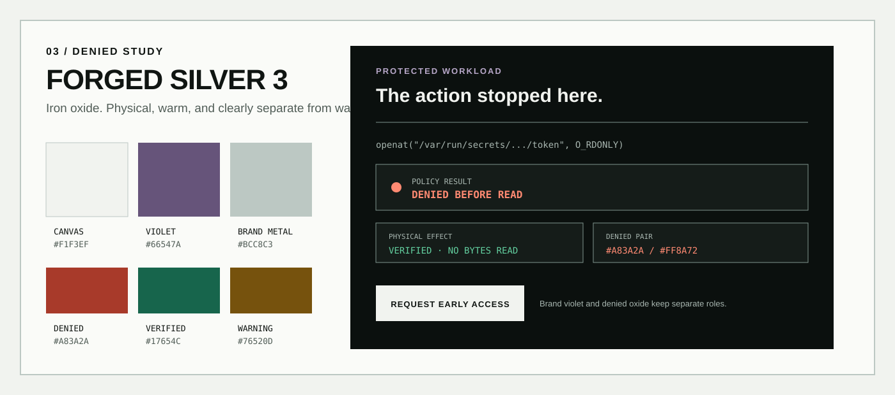
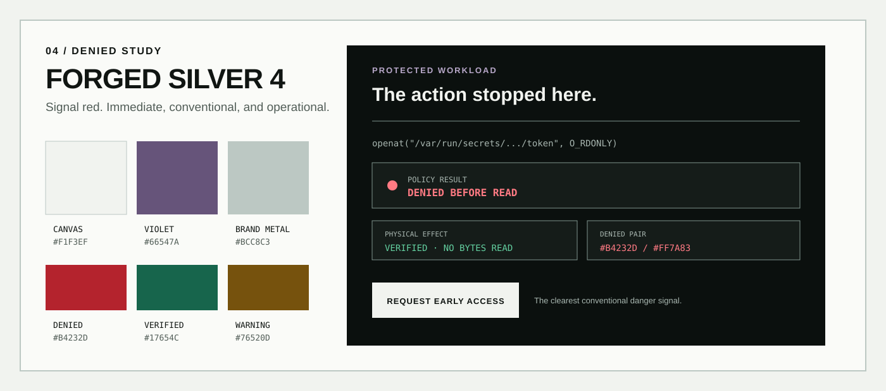
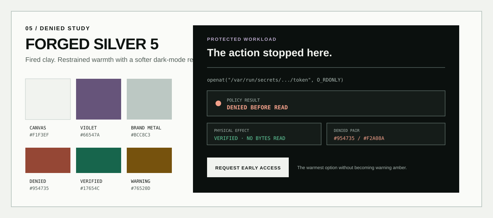
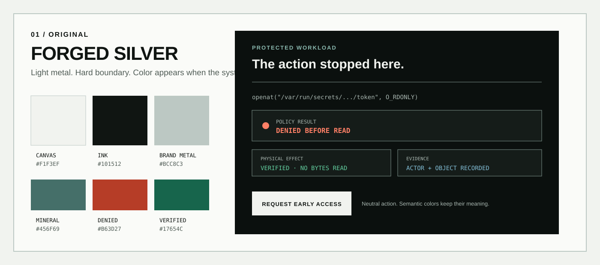
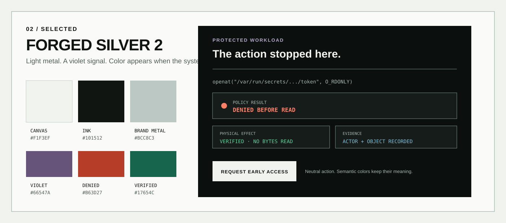
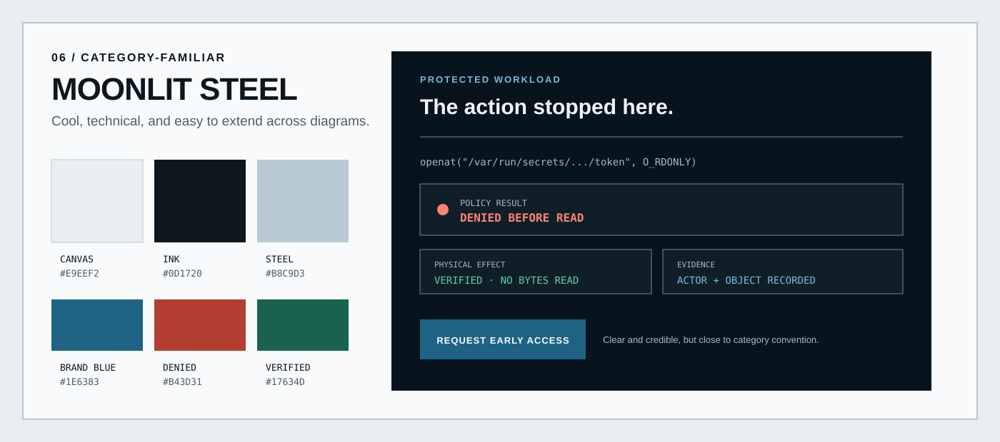
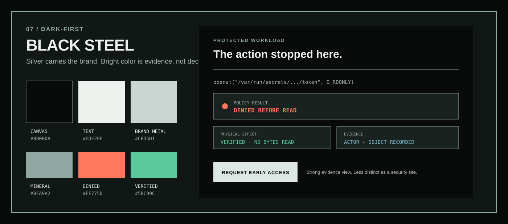
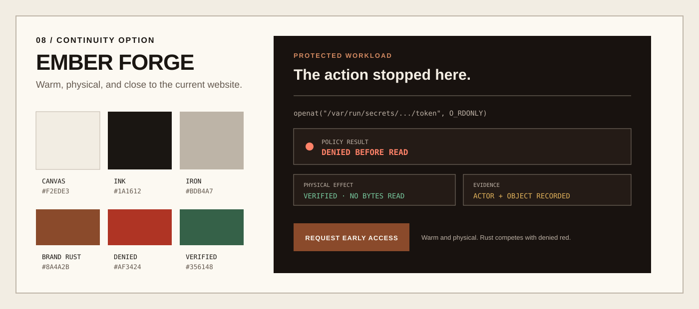

# Araphor Color Themes

This study defines eight color directions for the Araphor website and product.
Forged Silver 5 is applied to the website for evaluation. The selected scheme
can change through one attribute in `index.html`.

## Recommendation

Use **Forged Silver 2** as the base direction. The website currently trials
**Forged Silver 5**, which changes only the denied pair.

If the denied color changes, use **Forged Silver 3**. Its iron-oxide pair is
closest to Ember Forge. It is warmer and quieter than the current denied pair,
but it stays red enough to remain separate from warning amber.

Araphor needs a visual identity that communicates a defended system boundary.
A cold silver base and a near-black boundary do that without using medieval decoration. The
palette also separates brand actions from security results:

- the Araphor brand uses silver, graphite, and a muted forge violet;
- the primary call to action uses graphite, not a danger color;
- denied, verified, warning, and information keep distinct semantic colors;
- the light and dark surfaces use different semantic values when necessary.

This separation fixes the main weakness in the current palette. The current
orange can mean either “take this sales action” or “Araphor denied an action.” A
visitor should not have to infer which meaning applies.

## Research findings

The research supports four rules:

1. Name tokens by purpose, not by hue. Atlassian recommends that teams choose a
   token for its meaning and not because a raw color looks similar. It also
   separates accents from danger, warning, and success colors.
2. Do not reuse one value across light and dark surfaces without a check.
   Tailscale found that dark surfaces needed adjusted color values, stronger
   borders, and explicit semantic classes.
3. Test every text and control pairing. WCAG 2.2 requires at least `4.5:1` for
   normal text and `3:1` for large text and essential user-interface graphics.
4. Never make color the only result signal. Keep the `DENIED`, `VERIFIED`,
   `WARNING`, and `INFORMATION` labels, icons, and shapes.

The denied studies follow three additional rules. Primer assigns danger and
warning to different semantic roles. Carbon uses separate error values for
normal and inverse surfaces. Apple recommends a consistent meaning for each
color and separate variants for light and dark contexts. These systems keep
danger in the red family. Araphor therefore does not use orange as the denied
color because orange would move too close to its amber warning state.

The review also included the current websites for Manifold, Asymptote,
Chainguard, and Tailscale. My design inference is that a dark base with a bright
blue or green accent will look familiar in infrastructure security, but it will
not make Araphor distinct. Cold metal gives the execution boundary a physical
presence without making the site look like a generic AI product.

## Denied-color comparison

| Forged Silver 3 · iron oxide | Forged Silver 4 · signal red | Forged Silver 5 · fired clay |
| --- | --- | --- |
|  |  |  |
| `#A83A2A` / `#FF8A72` | `#B4232D` / `#FF7A83` | `#954735` / `#F2A08A` |

## 01. Forged Silver

This is the original Forged Silver direction. It uses a muted mineral teal as
the brand signal. The neutral and semantic colors are the same as Forged
Silver 2.

| Role | Light surface | Dark surface | Use |
| --- | --- | --- | --- |
| Canvas | `#F1F3EF` | `#0B100E` | Page background and deep evidence sections |
| Surface | `#FAFBF8` | `#151C19` | Raised fields and evidence panels |
| Primary text | `#101512` | `#F1F3EF` | Headings, body text, and neutral actions |
| Secondary text | `#515D57` | `#A8B6B0` | Supporting copy and metadata |
| Brand metal | `#BCC8C3` | `#80938D` | Logo field, quiet separators, and large decoration |
| Mineral accent | `#456F69` | `#8AB8AE` | Focus, selection, essential boundaries, and brand detail; not a result |
| Denied | `#B63D27` | `#FF8066` | A prohibited physical effect was stopped |
| Verified | `#17654C` | `#63D0A0` | A positive physical result was verified |
| Warning | `#76520D` | `#E1B35A` | Unsupported, uncertain, or degraded state |
| Information | `#2B6075` | `#82BED6` | Neutral product and system information |

**Primary action:** `#101512` background with `#FAFBF8` text. Use mineral teal
for focus and selection.

**Tradeoff:** The teal is controlled and technical, but it gives the brand less
separation from other infrastructure products.

## 02. Forged Silver 2

**Base direction.** This direction is cold, physical, and quiet. A restrained violet
cast gives Araphor a distinct signal without using a bright AI-style gradient.
It has the best fit with the defended-boundary idea and the existing
industrial-evidence design.

| Role | Light surface | Dark surface | Use |
| --- | --- | --- | --- |
| Canvas | `#F1F3EF` | `#0B100E` | Page background and deep evidence sections |
| Surface | `#FAFBF8` | `#151C19` | Raised fields and evidence panels |
| Primary text | `#101512` | `#F1F3EF` | Headings, body text, and neutral actions |
| Secondary text | `#515D57` | `#A8B6B0` | Supporting copy and metadata |
| Brand metal | `#BCC8C3` | `#80938D` | Logo field, quiet separators, and large decoration |
| Forge violet | `#66547A` | `#B7A7C8` | Focus, selection, essential boundaries, and brand detail; not a result |
| Denied | `#B63D27` | `#FF8066` | A prohibited physical effect was stopped |
| Verified | `#17654C` | `#63D0A0` | A positive physical result was verified |
| Warning | `#76520D` | `#E1B35A` | Unsupported, uncertain, or degraded state |
| Information | `#2B6075` | `#82BED6` | Neutral product and system information |

**Primary action:** `#101512` background with `#FAFBF8` text. Use forge violet
for focus and selection. Do not use denied orange for sales actions.

**Tradeoff:** Keep the violet muted and scarce. A saturated or dominant purple
would weaken the forged-metal identity and make the site look generic.

## 03. Forged Silver 3

**Recommended denied study.** This variant changes only the denied pair. Iron
oxide connects the result to forged metal and Ember Forge without turning the
result into warning orange.

| Role | Light surface | Dark surface | Contrast |
| --- | --- | --- | --- |
| Denied · iron oxide | `#A83A2A` | `#FF8A72` | `5.69:1` light and `8.34:1` dark |

**Design basis:** This pair uses a red-orange hue, controlled saturation, and a
large lightness change between modes. It has the closest relationship to Ember
Forge while preserving the red danger convention.

**Tradeoff:** It is a restrained signal. Labels and the stop shape must provide
the strongest emphasis.

## 04. Forged Silver 4

This variant uses a clearer signal red. It follows the conventional danger
direction used by mature product design systems.

| Role | Light surface | Dark surface | Contrast |
| --- | --- | --- | --- |
| Denied · signal red | `#B4232D` | `#FF7A83` | `5.84:1` light and `7.64:1` dark |

**Design basis:** The redder hue follows a familiar danger convention and gives
the largest hue separation from amber warning in this study.

**Tradeoff:** It is the least distinctive option. It feels more like a standard
application error than hot forged material.

## 05. Forged Silver 5

**Active website trial.** This variant uses fired clay. It is the warmest and
quietest denied direction.

| Role | Light surface | Dark surface | Contrast |
| --- | --- | --- | --- |
| Denied · fired clay | `#954735` | `#F2A08A` | `5.82:1` light and `9.29:1` dark |

**Design basis:** Lower saturation integrates the denied state with silver,
graphite, and violet. The hue remains red-orange instead of warning amber.

**Tradeoff:** The softer signal has less urgency. It is better for evidence and
status display than for emergency alerts.

## 06. Moonlit Steel

This direction is cooler and more technical. It will feel familiar to security
and infrastructure buyers, and it will be easy to extend into diagrams.

| Role | Light surface | Dark surface | Use |
| --- | --- | --- | --- |
| Canvas | `#E9EEF2` | `#07131D` | Page background and deep technical sections |
| Surface | `#F8FAFB` | `#101E28` | Raised fields and evidence panels |
| Primary text | `#0D1720` | `#EFF4F7` | Headings and body text |
| Secondary text | `#4B5E6C` | `#AABAC4` | Supporting copy and metadata |
| Steel | `#B8C9D3` | `#718B99` | Logo field, quiet separators, and large decoration |
| Brand blue | `#1E6383` | `#77BBDB` | Primary action, focus, and selection |
| Denied | `#B43D31` | `#FF8372` | A prohibited physical effect was stopped |
| Verified | `#17634D` | `#61D1A2` | A positive physical result was verified |
| Warning | `#74540F` | `#E2B65F` | Unsupported, uncertain, or degraded state |

**Primary action:** `#1E6383` background with `#F8FAFB` text.

**Tradeoff:** This is the safest category choice and the least ownable. Blue can
make Araphor look like another cloud-security company.

## 07. Black Steel

This direction makes the website dark first. Silver becomes the main brand
signal. Bright colors appear only for results and active controls.

| Role | Value | Use |
| --- | --- | --- |
| Canvas | `#080B0A` | Page background |
| Surface | `#111714` | Primary sections and fields |
| Raised surface | `#19221E` | Evidence panels and overlays |
| Primary text | `#EDF2EF` | Headings and body text |
| Secondary text | `#A7B5AF` | Supporting copy and metadata |
| Brand metal | `#CBD5D1` | Logo, primary action, rules, and diagrams |
| Mineral accent | `#8FA9A2` | Focus, selection, and brand detail |
| Denied | `#FF775D` | A prohibited physical effect was stopped |
| Verified | `#5BC99C` | A positive physical result was verified |
| Warning | `#E2B35D` | Unsupported, uncertain, or degraded state |
| Information | `#7FB9CF` | Neutral product and system information |

**Primary action:** `#DCE6E2` background with `#0B100E` text.

**Tradeoff:** It makes evidence and the interactive path look excellent, but a
dark-first security site is less distinct. Long marketing copy also needs more
care on dark surfaces.

## 08. Ember Forge

This direction evolves the current warm paper and orange identity. It feels
industrial and human, and it keeps the most continuity with the existing site.

| Role | Light surface | Dark surface | Use |
| --- | --- | --- | --- |
| Canvas | `#F2EDE3` | `#18120F` | Page background and deep evidence sections |
| Surface | `#FCF9F2` | `#241B16` | Raised fields and evidence panels |
| Primary text | `#1A1612` | `#F4EEE4` | Headings and body text |
| Secondary text | `#655A50` | `#BDB1A5` | Supporting copy and metadata |
| Iron | `#BDB4A7` | `#82776B` | Logo field, quiet separators, and large decoration |
| Brand rust | `#8A4A2B` | `#D48A61` | Primary action, focus, and selection |
| Denied | `#AF3424` | `#FF8268` | A prohibited physical effect was stopped |
| Verified | `#356148` | `#77C99E` | A positive physical result was verified |
| Warning | `#78540E` | `#E0B15A` | Unsupported, uncertain, or degraded state |

**Primary action:** `#8A4A2B` background with `#FCF9F2` text.

**Tradeoff:** Rust and denied red remain close in hue. This direction is warmer
than the defender story and risks a forge or fantasy theme instead of a system boundary.

## Comparison

| Direction | Name fit | Product clarity | Category distinction | Main risk |
| --- | --- | --- | --- | --- |
| Forged Silver | Strong | Strong | Medium | Teal is common in infrastructure products |
| **Forged Silver 2** | Strong | Strong | Strong | Violet must remain muted and scarce |
| **Forged Silver 3** | Strong | Strong | Strong | Restrained denial needs a clear label and stop shape |
| Forged Silver 4 | Medium | Strong | Medium | Conventional application-error red |
| Forged Silver 5 | Strong | Medium | Strong | Softer denial has less urgency |
| Moonlit Steel | Medium | Strong | Weak | Looks like standard cloud security |
| Black Steel | Strong | Strong | Medium | Dark security sites are common |
| Ember Forge | Medium | Medium | Medium | Brand and denied colors are too close |

## Contrast check

All text pairings shown in the previews meet WCAG AA for normal text. The
lowest checked ratio is `4.92:1` for Moonlit Steel denied text on its light
canvas. Primary text pairings range from `15.42:1` to `17.46:1`.

The listed metal colors are for large graphics, borders, or decoration. Do not
use them for small text without a separate contrast check. Keep text labels and
icons with every semantic color so a result never depends on hue alone.

## Sources

- [W3C: Understanding contrast minimum](https://www.w3.org/WAI/WCAG22/Understanding/contrast-minimum.html)
- [Atlassian: Color roles and semantic tokens](https://atlassian.design/foundations/color-new/)
- [Atlassian: Design tokens](https://atlassian.design/foundations/tokens/design-tokens/)
- [IBM Carbon: Color tokens](https://carbondesignsystem.com/elements/color/tokens/)
- [GitHub Primer: Color usage](https://primer.style/product/getting-started/foundations/color-usage/)
- [Apple: Color](https://developer.apple.com/design/human-interface-guidelines/color)
- [Tailscale: Lessons from adding dark mode](https://tailscale.com/blog/heart-of-dark-mode)
- [Radix Colors: Accessible interface color scales](https://www.radix-ui.com/colors)
- [Manifold](https://www.manifold.security/)
- [Asymptote](https://asymptotelabs.ai/)
- [Chainguard](https://www.chainguard.dev/)
- [Tailscale](https://tailscale.com/)
